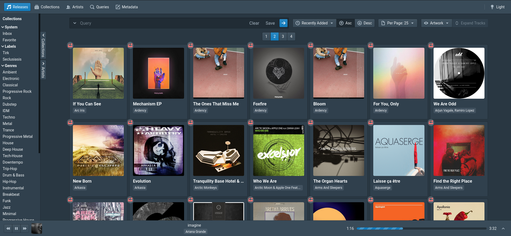

# repertoire

[](https://travis-ci.org/azuline/repertoire)
[](https://repertoire.readthedocs.io/en/latest/?badge=latest)

A release-oriented music server. Work in progress!



## License

```
repertoire :: a release-oriented music server

Copyright (C) 2020 azuline

This program is free software: you can redistribute it and/or modify it under
the terms of the GNU Affero General Public License as published by the Free
Software Foundation, either version 3 of the License, or (at your option) any
later version.

This program is distributed in the hope that it will be useful, but WITHOUT ANY
WARRANTY; without even the implied warranty of MERCHANTABILITY or FITNESS FOR A
PARTICULAR PURPOSE.  See the GNU Affero General Public License for more
details.

You should have received a copy of the GNU Affero General Public License along
with this program.  If not, see <https://www.gnu.org/licenses/>.
```
