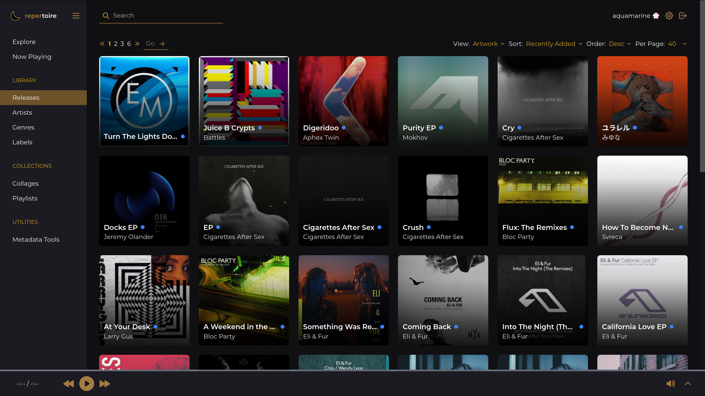
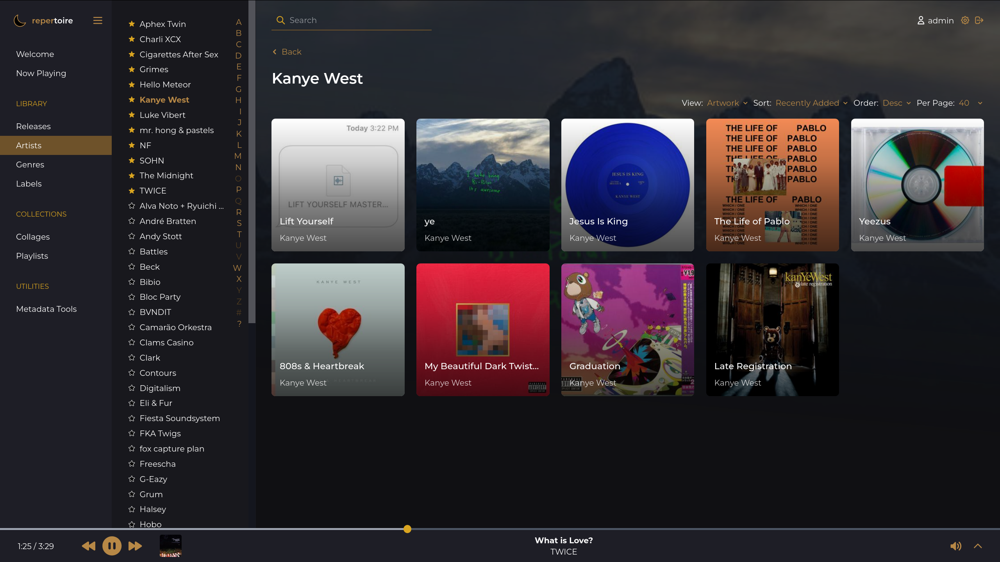
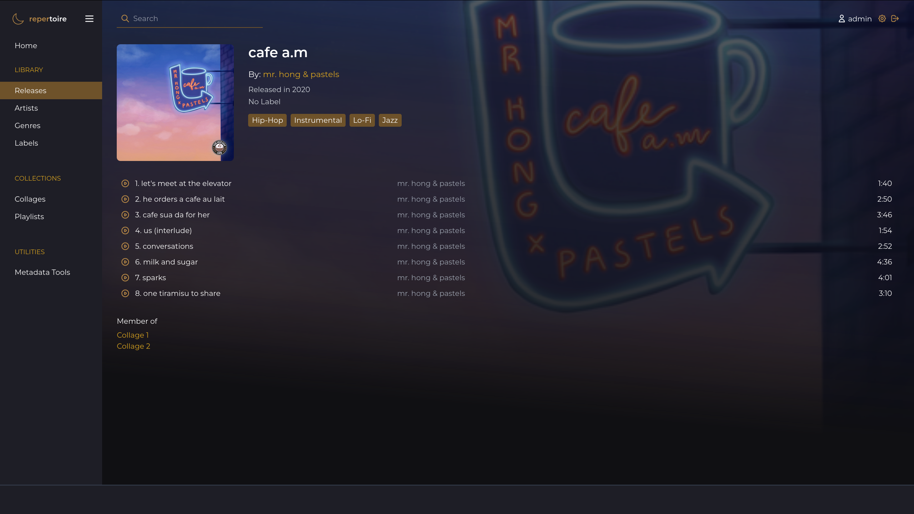
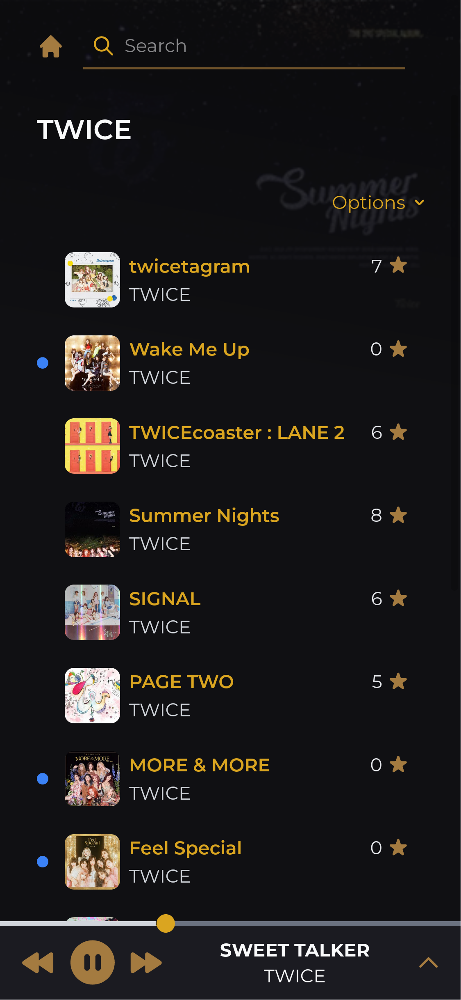

# repertoire

[](https://github.com/azuline/repertoire/actions?query=workflow%3ABackend)
[](https://github.com/azuline/repertoire/actions?query=workflow%3AFrontend)
[](https://repertoire.readthedocs.io/en/latest/?badge=latest)
[](https://hub.docker.com/r/blissful/repertoire)
[](https://codecov.io/gh/azuline/repertoire)

A music server designed to catalog and facilitate exploration of large music
libraries.

Visit [the documentation](https://repertoire.readthedocs.io) to get started!

## Screenshots









## License

```
repertoire :: a music server for cataloguing and exploring large music
              libraries

Copyright (C) 2021 blissful

This program is free software: you can redistribute it and/or modify it under
the terms of the GNU Affero General Public License as published by the Free
Software Foundation, either version 3 of the License, or (at your option) any
later version.

This program is distributed in the hope that it will be useful, but WITHOUT ANY
WARRANTY; without even the implied warranty of MERCHANTABILITY or FITNESS FOR A
PARTICULAR PURPOSE.  See the GNU Affero General Public License for more
details.

You should have received a copy of the GNU Affero General Public License along
with this program.  If not, see <https://www.gnu.org/licenses/>.
```

## Scratchpad

Since GQL API can create release, need to have functions to scan its tracks for
cover art and/or upload art.
