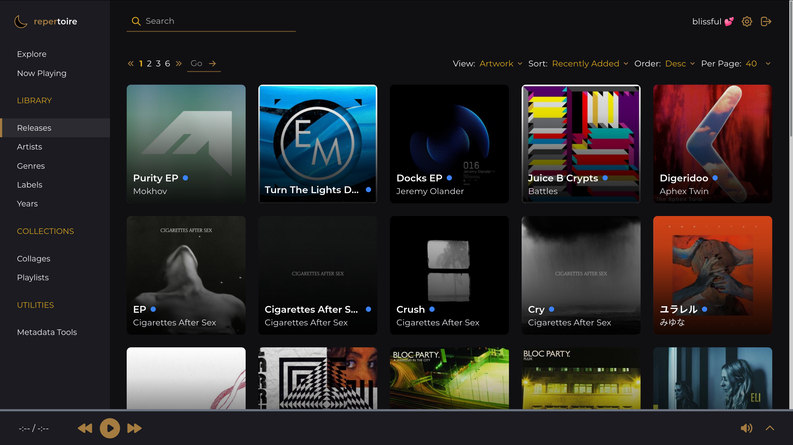
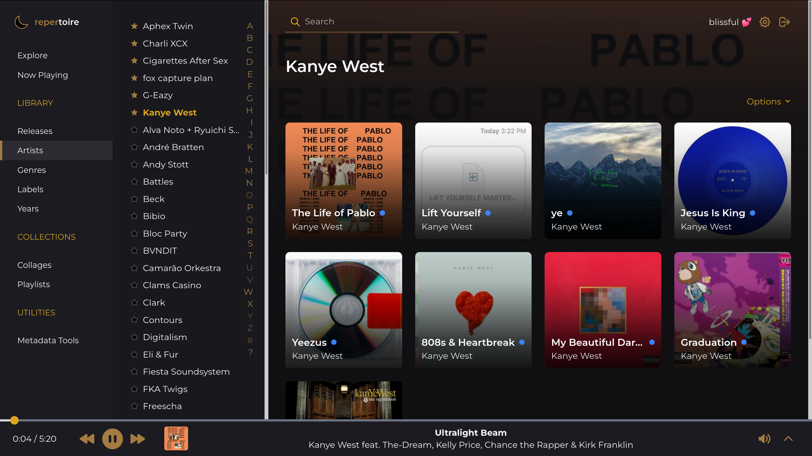

# repertoire

[](https://github.com/azuline/repertoire/actions)
[](https://repertoire.readthedocs.io/en/latest/?badge=latest)
[](https://codecov.io/gh/azuline/repertoire)
[](https://discord.gg/yaXtjgMzCe)

A release-oriented music server. Work in progress!

Visit [the documentation](https://repertoire.readthedocs.io) to get started!

## Screenshots






## License

```
repertoire :: a release-oriented music server

Copyright (C) 2020 azuline

This program is free software: you can redistribute it and/or modify it under
the terms of the GNU Affero General Public License as published by the Free
Software Foundation, either version 3 of the License, or (at your option) any
later version.

This program is distributed in the hope that it will be useful, but WITHOUT ANY
WARRANTY; without even the implied warranty of MERCHANTABILITY or FITNESS FOR A
PARTICULAR PURPOSE.  See the GNU Affero General Public License for more
details.

You should have received a copy of the GNU Affero General Public License along
with this program.  If not, see <https://www.gnu.org/licenses/>.
```

## Scratchpad

We are binding TypeScript to version 4.0.3 right now because CRA is broken with
the newest version. Will unbind when it is fixed.

Since GQL API can create release, need to have functions to scan its tracks for
cover art and/or upload art.
