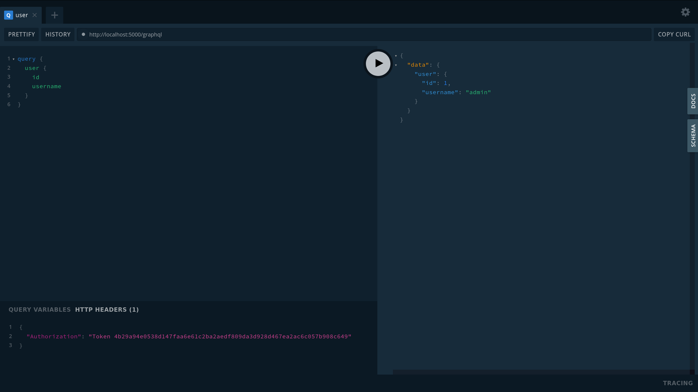

.. _advanced_server_api:

Server API
==========

The backend webserver API consists of several REST-flavored API endpoints and a
GraphQL API.

The GraphQL API is available via ``POST`` requests to the ``/graphql``
endpoint.

GraphQL Playground
------------------

The "GraphQL Playground" is packaged with repertoire. It provides a graphical
playground to explore the schema documentation and query the backend, and it
can be accessed by visiting the ``/graphql`` endpoint in your browser. By
default, it is disabled.

To run the "GraphQL Playground," repertoire's backend webserver must be run in
debug mode. See :ref:`hacking_environment` to set up a development environment
and run the backend webserver in debug mode.

Authentication
^^^^^^^^^^^^^^

Many GraphQL resources are restricted to authenticated users. To authenticate
in "GraphQL Playground," the ``Authorization`` HTTP header must be set to
``Token {valid_token}``.

A valid token can be generated with the shell command ``$ repertoire token``.

The playground should look like (but with your generated token):

GraphQL Schema
^^^^^^^^^^^^^^

For quick reference, the raw GraphQL schema is included below:

.. literalinclude:: ../../backend/graphql/schema.graphql

REST-Flavored Endpoints
-----------------------

The REST flavored endpoints of the API are as follows:

File Serving
^^^^^^^^^^^^

These endpoints serve the music and image files stored on the backend.

.. autoflask:: backend.webserver.app:create_app()
   :modules: backend.webserver.routes.files
   :groupby: view
   :order: path
